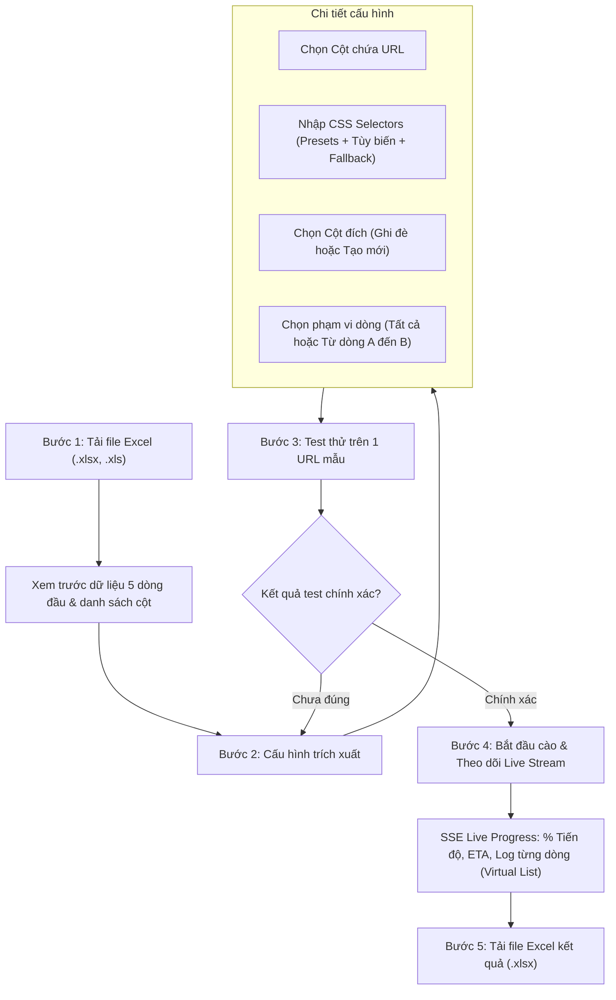
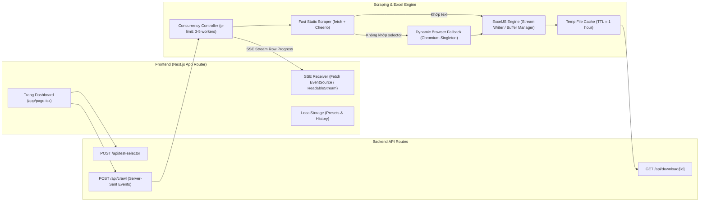

# Thiết Kế Kỹ Thuật: Hệ Thống Cào Dữ Liệu Web & Cập Nhật File Excel (Excel Web Scraper & Enricher)

- **Ngày tạo:** 2026-09-21
- **Trạng thái:** Chờ phê duyệt (Pending Review)
- **Tác giả:** Antigravity & Người dùng

---

## 1. Tổng Quan & Mục Tiêu (Overview & Goals)

Hệ thống **Excel Web Scraper & Enricher** là một ứng dụng web gọn gàng, thân thiện với người dùng, phục vụ mục đích duy nhất:
1. Cho phép người dùng tải lên một file Excel (`.xlsx`, `.xls`).
2. Chọn cột chứa danh sách URL cần cào dữ liệu.
3. Cấu hình danh sách CSS Selector (hỗ trợ mẫu có sẵn, thêm/xóa/sửa linh hoạt, cơ chế ưu tiên fallback).
4. Cấu hình cột đích (chọn cột có sẵn để ghi đè/bổ sung, hoặc tạo cột mới ở cuối bảng).
5. Cho phép bấm "Test thử 1 URL mẫu" để kiểm tra tính chính xác của selector trước khi chạy hàng loạt.
6. Backend mở từng URL, phân tích DOM (kết hợp tải HTML tĩnh siêu tốc bằng Cheerio, tự động fallback sang Playwright Headless Browser cho các trang web động/SPA), trích xuất `textContent` của selector đầu tiên khớp.
7. Cập nhật dữ liệu trích xuất được vào đúng dòng tương ứng trong file Excel (bảo toàn 100% định dạng, kiểu dáng, công thức của file gốc).
8. Bắn sự kiện tiến trình thời gian thực (Server-Sent Events - SSE) lên giao diện: thanh tiến độ %, thời gian ước tính, bảng log trực quan.
9. Tích hợp giải pháp 5 lớp chống treo máy và xử lý an toàn cho file nặng / hàng nghìn dòng.
10. Cung cấp đường dẫn để người dùng tải file Excel hoàn thiện về máy tính.

---

## 2. Luồng Trải Nghiệm Người Dùng (User Workflow)

### Chi tiết từng bước trên giao diện:
1. **Bước 1: Tải file & Xem trước (Upload & Preview)**
   - Khung kéo thả file (Drag & Drop) trực quan, hỗ trợ file `.xlsx`, `.xls`.
   - Client phân tích nhanh: Hiển thị danh sách Sheet (cho phép chuyển sheet), bảng xem trước 5 dòng đầu tiên kèm tiêu đề các cột.
2. **Bước 2: Cấu hình trích xuất (Configuration)**
   - **Cột URL**: Dropdown chọn cột chứa link web.
   - **Danh sách CSS Selector**:
     - Cung cấp các **Preset mẫu** bấm chọn nhanh (Tiêu đề: `h1, .entry-title, [itemprop="headline"]`, Giá cả: `.price, .product-price, [data-price]`, Nội dung: `article, .post-content, main p`).
     - Cho phép thêm từng selector (+), xóa bớt (x), chỉnh sửa trực tiếp.
     - Cơ chế: Duyệt từ trên xuống dưới, selector nào xuất hiện đầu tiên và có nội dung sẽ được chọn.
     - Tự động lưu danh sách selector vào `localStorage` của trình duyệt.
   - **Cột đích (Target Column)**:
     - Tùy chọn 1: Chọn một cột đã có sẵn trong bảng để cập nhật.
     - Tùy chọn 2: Nhập tên cột mới (ví dụ: `Extracted_Content`) để tự tạo thêm cột ở cuối sheet.
   - **Phạm vi cào (Row Range)**:
     - Mặc định: "Cào tất cả dòng có URL".
     - Tùy chọn: "Chỉ cào từ dòng [X] đến dòng [Y]" (hỗ trợ kiểm thử file nặng).
3. **Bước 3: Test thử trên URL mẫu (Test Selector Preview)**
   - Bấm nút **"Test thử 1 URL"**: Hệ thống lấy URL hợp lệ đầu tiên, gửi lên BE cào thử trong ~1s.
   - Hiển thị popover/modal: Selector nào khớp, đoạn text trích xuất được, tốc độ phản hồi.
4. **Bước 4: Bắt đầu cào & Tiến trình thời gian thực (Live Execution)**
   - Bấm **"Bắt đầu xử lý"**.
   - Thanh tiến độ hiển thị: `%`, số lượng đã xong (ví dụ: `45/120 dòng`), số thành công, số lỗi, thời gian ước tính còn lại (ETA).
   - Bảng log thời gian thực: Hiển thị 50 dòng hoạt động gần nhất (Virtual List chống đơ trình duyệt).
   - Nút **"Dừng lại" (Abort)** để hủy ngay lập tức nếu cần.
5. **Bước 5: Tải file kết quả**
   - Khi tiến độ đạt 100%, xuất hiện thông báo hoàn thành và nút lớn: **"Tải file Excel kết quả (.xlsx)"**.
   - Bấm nút tải trực tiếp file về máy.

---

## 3. Kiến Trúc Kỹ Thuật (System Architecture)

Toàn bộ ứng dụng được xây dựng trên nền tảng **Fullstack Next.js App Router (React 19 + TypeScript + Tailwind CSS v4)**.

### 3.1. API Endpoints
1. **`POST /api/test-selector`**:
   - **Request JSON**: `{ url: string, selectors: string[] }`
   - **Response**: `{ success: boolean, matchedSelector?: string, textContent?: string, method: 'static' | 'browser', durationMs: number, error?: string }`
2. **`POST /api/crawl`**:
   - **Request `multipart/form-data`**:
     - `file`: File Excel nhị phân (`.xlsx` hoặc `.xls`).
     - `sheetName`: Tên sheet cần xử lý.
     - `urlColumnIndex`: Chỉ số cột chứa URL (1-indexed hoặc tên cột).
     - `targetColumnConfig`: JSON `{ mode: 'existing', colIndex: number }` hoặc `{ mode: 'new', colName: string }`.
     - `selectors`: JSON array string `["h1", ".title", "#price"]`.
     - `rowRange`: JSON `{ startRow?: number, endRow?: number }`.
   - **Response**: Header `Content-Type: text/event-stream; charset=utf-8`.
     - Stream các event theo định dạng SSE:
       - `event: start` -> `{ totalRows: number }`
       - `event: row_progress` -> `{ rowIndex: number, url: string, status: 'success' | 'failed' | 'skipped', matchedSelector?: string, text?: string, error?: string, progressPercent: number, processedCount: number, etaSeconds: number }`
       - `event: complete` -> `{ success: true, downloadId: string, summary: { total: number, succeeded: number, failed: number, skipped: number } }`
       - `event: error` -> `{ message: string }`
3. **`GET /api/download/[id]`**:
   - Tải file Excel hoàn chỉnh với tên: `<ten_goc>_updated.xlsx`.

### 3.2. Cơ Chế Scraping Kết Hợp (Hybrid Scraping Pipeline)
1. **Lớp 1: Static Fast Scraper (Cheerio + Node Fetch)**
   - Gửi HTTP `fetch` với timeout 5 giây, kèm header User-Agent hiện đại (Chrome 130+).
   - Load HTML vào `cheerio`.
   - Lặp qua danh sách `selectors`: Nếu `$(selector).length > 0` và có text sau khi trim, trả về kết quả ngay (tốc độ ~0.1s - 0.4s/URL, không tốn RAM).
2. **Lớp 2: Dynamic Scraper (Playwright Chromium Fallback)**
   - Chỉ kích hoạt khi Lớp 1 không tìm thấy selector nào (hoặc trang trả về HTML rỗng do yêu cầu JavaScript/SPA).
   - Quản lý Chromium browser theo mô hình **Singleton Instance** dùng chung, chỉ tạo `browserContext` mới và `page` mới cho từng URL.
   - `page.goto(url, { waitUntil: 'domcontentloaded', timeout: 8000 })`.
   - Query selector, lấy `textContent`, đóng page ngay lập tức để giải phóng RAM.
   - Tự động restart Chromium sau mỗi 100 trang được cào bằng browser để triệt tiêu nguy cơ rò rỉ bộ nhớ (memory leak).
3. **Kiểm soát đồng thời (Concurrency Control)**
   - Áp dụng `p-limit` với mức concurrency từ 3 đến 5 worker đồng thời. Đảm bảo tốc độ nhanh nhưng không gây tắc nghẽn CPU hoặc băng thông mạng.

---

## 4. Xử Lý File Nặng & Chống Treo Máy (Performance & Heavy File Safeguards)

Áp dụng chiến lược 5 lớp bảo vệ toàn diện:
1. **Kiểm soát phạm vi cào (Row Range Selection)**: Cho phép cào theo batch hoặc theo khoảng dòng người dùng chọn (ví dụ: dòng 2 đến 100), tránh vô tình cào 10.000 dòng một lúc.
2. **Streaming Excel Processing (`exceljs`)**:
   - Sử dụng streaming buffer để ghi dữ liệu, không giữ toàn bộ cấu trúc file khổng lồ trong bộ nhớ RAM của server.
   - Giới hạn dung lượng upload file tối đa: 30MB (có cảnh báo rõ ràng nếu vượt quá).
3. **Thu hồi tài nguyên theo từng mẻ (Batching & GC)**:
   - Dữ liệu được gom và ghi xả theo từng lô 25 dòng.
   - Dọn dẹp các biến tạm sau mỗi batch để Garbage Collector của Node.js giải phóng heap memory.
4. **Bảng Log ảo hóa (Virtual List Log UI)**:
   - Client chỉ giữ và render tối đa 100 sự kiện log gần nhất vào DOM. Tránh việc render hàng nghìn thẻ HTML gây đơ tab trình duyệt của người dùng.
5. **Ước tính thời gian & Tự động ngắt kết nối (ETA & AbortController)**:
   - Hiển thị thời gian dự kiến hoàn thành theo tốc độ thực tế.
   - Hỗ trợ `AbortSignal`: Khi người dùng bấm nút "Dừng" hoặc tắt tab, server lập tức hủy bỏ các tiến trình con và giải phóng tài nguyên.
   - File kết quả tạm thời được tự động xóa sau 1 giờ (TTL = 1 hour).

---

## 5. Làm Sạch Dữ Liệu & Xử Lý Ngoại Lệ (Data Cleaning & Edge Cases)

| Tình huống ngoại lệ | Cách xử lý của hệ thống |
|---|---|
| **URL thiếu protocol** (`abc.com/product`) | Tự động thêm tiền tố `https://` để tạo URL hợp lệ. |
| **Ô trống hoặc text không phải URL** | Bỏ qua dòng đó, ghi log `[Bỏ qua: Không phải URL]`, giữ nguyên ô tương ứng trong Excel. |
| **URL lỗi 404 / 403 / Timeout** | Bắt lỗi an toàn, đánh dấu `[Lỗi cào dữ liệu]` trên log, ghi ô trống trong Excel, tiếp tục cào các dòng tiếp theo mà không dừng tiến trình. |
| **Không tìm thấy selector nào khớp** | Đánh dấu `[Không tìm thấy selector]`, để trống ô đích trong Excel. |
| **Văn bản cào được dính nhiều khoảng trắng/ký tự lạ** | Tự động sanitize: loại bỏ entity lạ (`&nbsp;`, `&amp;`), chuẩn hóa khoảng trắng thừa và ngắt dòng liên tiếp, trim đầu cuối. |
| **Bảo toàn định dạng file gốc** | `exceljs` giữ nguyên màu sắc ô, viền border, font chữ, độ rộng cột của toàn bộ các cột khác trong sheet. |

---

## 6. Kế Hoạch Triển Khai (Next Steps)

Sau khi bản Spec này được người dùng phê duyệt:
1. Chuyển sang kỹ năng `writing-plans` để lập kế hoạch triển khai chi tiết theo từng bước (Tasks Breakdown).
2. Cài đặt các thư viện cần thiết: `exceljs`, `cheerio`, `playwright`, `p-limit`, `lucide-react`.
3. Xây dựng Scraper Service (Cheerio + Playwright Singleton).
4. Xây dựng API Test Selector & API Crawl SSE Stream.
5. Xây dựng Giao diện người dùng (Dashboard, File Upload, Selector Configurator, Live Log & Download).
6. Kiểm thử tích hợp toàn bộ luồng với file Excel thực tế và các trang web mẫu.
