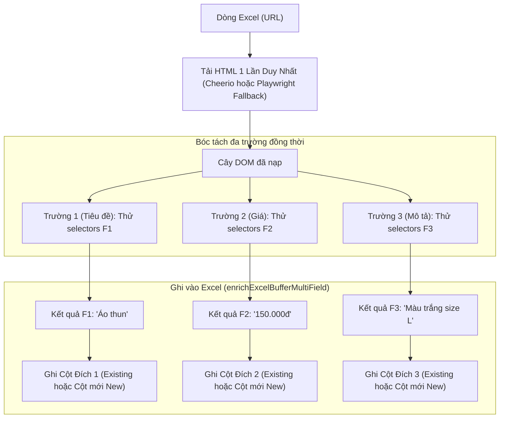

# Thiết Kế Kỹ Thuật: Bóc Tách Đa Cột & Quản Lý Cấu Hình Neon Postgres (ExcelFlow v2)

- **Ngày tạo:** 2026-09-22
- **Trạng thái:** Chờ phê duyệt (Pending Review)
- **Tác giả:** Antigravity & Người dùng

---

## 1. Tổng Quan & Mục Tiêu (Overview & Goals)

Nâng cấp ứng dụng **ExcelFlow** nhằm đáp ứng các yêu cầu mở rộng:
1. **Bóc tách đa trường dữ liệu (Multi-field Extraction):** Từ cùng 1 URL nguồn trên mỗi dòng Excel, cho phép người dùng bóc tách nhiều trường thông tin khác nhau (ví dụ: Tiêu đề, Giá, Mô tả, Ảnh đại diện...) và ghi vào các cột đích tương ứng riêng biệt (cột có sẵn hoặc cột mới).
2. **Text Note trực quan khi tạo cột mới:** Khi người dùng chọn chế độ tạo cột mới ở cuối bảng tính Excel, giao diện hiển thị thông báo ghi chú rõ ràng (callout trực quan) xác nhận tên cột sẽ được tạo tự động để tránh nhầm lẫn.
3. **Loại bỏ các mẫu nhanh tĩnh (Remove Quick Presets):** Xóa bỏ các nút mẫu nhanh cố định cũ (`Tiêu đề`, `Giá`, `Mô tả`) trong giao diện để thay thế bằng hệ thống cấu hình linh hoạt.
4. **Tích hợp Neon Postgres DB trên Vercel:** Lưu trữ bền vững các bộ cấu hình bóc tách (`saved_configs`) trên đám mây thông qua Neon Serverless Postgres, cho phép người dùng lưu, nạp và quản lý các bộ quy tắc bóc tách giữa các phiên làm việc. (Không lưu lịch sử jobs và job_items theo yêu cầu tinh gọn).

---

## 2. Kiến Trúc Cơ Sở Dữ Liệu Neon Postgres

### 2.1. Kết nối & Driver
* **Thư viện:** `@neondatabase/serverless` (driver chính thức cho Neon, tối ưu hoàn hảo cho Vercel Serverless Functions và runtime Bun, không có độ trễ cold-start).
* **Cấu hình môi trường:** Sử dụng biến môi trường chuẩn đã có sẵn trên Vercel: `DATABASE_URL` hoặc `POSTGRES_URL`.
* **Module kết nối:** `lib/db.ts` khởi tạo client Neon và hỗ trợ hàm `initDb()` tự động tạo bảng nếu chưa có (`CREATE TABLE IF NOT EXISTS`).

### 2.2. Schema Bảng `saved_configs`

```sql
CREATE TABLE IF NOT EXISTS saved_configs (
  id SERIAL PRIMARY KEY,
  name VARCHAR(255) NOT NULL,
  description TEXT,
  fields JSONB NOT NULL,
  created_at TIMESTAMP WITH TIME ZONE DEFAULT CURRENT_TIMESTAMP,
  updated_at TIMESTAMP WITH TIME ZONE DEFAULT CURRENT_TIMESTAMP
);

CREATE INDEX IF NOT EXISTS idx_saved_configs_updated_at ON saved_configs (updated_at DESC);
```

### 2.3. Cấu trúc TypeScript Types (`types/crawler.ts`)

```typescript
export interface TargetColumnExisting {
  mode: "existing";
  colIndex: number; // 1-indexed
}

export interface TargetColumnNew {
  mode: "new";
  colName: string;
}

export type TargetColumnConfig = TargetColumnExisting | TargetColumnNew;

export interface ExtractionFieldConfig {
  id: string; // uuid duy nhất cho UI tracking
  name: string; // Tên trường (vd: "Tiêu đề", "Giá", "Mô tả")
  selectors: string[]; // Danh sách CSS selectors fallback
  targetColumn: TargetColumnConfig;
}

export interface SavedConfigRecord {
  id: number;
  name: string;
  description?: string | null;
  fields: ExtractionFieldConfig[];
  createdAt: string;
  updatedAt: string;
}
```

### 2.4. REST API Quản lý Cấu hình (`app/api/configs/`)

| Method | Endpoint | Chức năng | Body / Params |
|---|---|---|---|
| `GET` | `/api/configs` | Lấy danh sách tất cả các cấu hình đã lưu | Không có |
| `POST` | `/api/configs` | Lưu bộ cấu hình mới | `{ name: string, description?: string, fields: ExtractionFieldConfig[] }` |
| `PUT` | `/api/configs/[id]` | Cập nhật cấu hình hiện có | `{ name: string, description?: string, fields: ExtractionFieldConfig[] }` |
| `DELETE` | `/api/configs/[id]` | Xóa cấu hình theo ID | `id: number` |

---

## 3. Pipeline Bóc Tách Đa Cột (Multi-field Extraction Pipeline)



### 3.1. Động cơ Bóc tách (`lib/scraper.ts`)
* Hàm `scrapeMultiField(url: string, fields: { id: string; selectors: string[] }[])`:
  1. Kiểm tra cache hoặc gọi fetch HTML tĩnh (Cheerio).
  2. Duyệt qua từng field trong danh sách `fields`, bóc tách `textContent` của selector đầu tiên khớp.
  3. Nếu có trường nào chưa tìm thấy kết quả và trang có dấu hiệu SPA động, fallback sang Playwright worker tải trang đầy đủ để trích xuất lại các trường còn thiếu.
  4. Trả về map kết quả: `Record<string, { text: string; matchedSelector?: string; error?: string } | null>`.
* **Hiệu năng:** Giảm thiểu 100% việc request trùng lặp URL; tốc độ cào cho 5 trường tương đương tốc độ cào 1 trường.

### 3.2. Động cơ Ghi Excel (`lib/excel-service.ts`)
* Hàm `enrichExcelBufferMultiField(options)`:
  * Nhận buffer gốc, danh sách `fields: ExtractionFieldConfig[]`, và `rowResults: Map<number, Record<string, string>>`.
  * Xác định các cột mới cần thêm vào bảng:
    * Duyệt các field có `targetColumn.mode === "new"`.
    * Tìm `maxColIndex` hiện tại của header row.
    * Gán tuần tự các cột mới: `targetColIndex = maxColIndex + 1`, `+ 2`,...
    * Ghi ô tiêu đề cột mới với định dạng in đậm `font: { bold: true }`.
  * Ghi kết quả từng dòng vào đúng cột tương ứng (cột có sẵn hoặc cột mới).
  * Bảo toàn toàn bộ sheet khác, styling, formulas của file gốc.

### 3.3. Cập nhật SSE Event Stream (`/api/crawl`)
* Event `row_progress` gửi về client chứa dữ liệu chi tiết của từng trường:
```json
{
  "rowIndex": 2,
  "url": "https://example.com/item-1",
  "status": "success",
  "fieldResults": {
    "field-uuid-1": { "name": "Tiêu đề", "text": "Sản phẩm A", "status": "success" },
    "field-uuid-2": { "name": "Giá", "text": "250.000đ", "status": "success" }
  },
  "progressPercent": 10,
  "processedCount": 1,
  "totalCount": 10,
  "etaSeconds": 15
}
```

---

## 4. Thiết Kế Giao Diện Người Dùng (UI/UX)

### 4.1. Thanh Quản Lý Cấu Hình Neon DB (Configuration Toolbar)
* Đặt tại đầu Bước 2 (Cấu hình trích xuất):
  * **Dropdown "Chọn cấu hình đã lưu":** Hiển thị danh sách các cấu hình đã lưu trong Neon DB. Khi bấm chọn, các trường bóc tách được nạp tự động vào form.
  * **Nút "💾 Lưu cấu hình này":** Mở modal cho phép nhập Tên cấu hình và Mô tả, gửi `POST /api/configs` lưu lên Neon DB.
  * **Nút quản lý/xóa (Trash icon):** Xóa cấu hình không còn dùng (`DELETE /api/configs/[id]`).

### 4.2. Danh Sách Các Trường Bóc Tách (Extraction Fields Manager)
* Thay thế hoàn toàn phần cấu hình đơn lẻ cũ.
* Hỗ trợ nút lớn **`+ Thêm trường cần lấy (Add Extraction Field)`**.
* Mỗi thẻ trường (Field Card):
  * Header thẻ: Tên trường (editable input, vd: *Tiêu đề*), nút xóa trường.
  * Khối Selectors: Danh sách CSS selector ưu tiên, ô nhập selector mới + nút Thêm.
  * Khối Cột Đích (Target Column):
    * 2 nút bấm chuyển chế độ: `+ Tạo cột mới ở cuối bảng` và `Ghi vào cột đã có`.
    * **Nếu chọn `Ghi vào cột đã có`:** Hiển thị dropdown chọn trong danh sách cột hiện tại của file Excel.
    * **Nếu chọn `Tạo cột mới ở cuối bảng`:**
      * Ô nhập tên tiêu đề cột mới (placeholder: vd `Tieu_De_Moi`).
      * **Text Note hiển thị trực quan (Callout màu xanh Indigo):**
        > 📌 **Ghi chú:** Hệ thống sẽ tự động tạo thêm một cột mới có tiêu đề là **`[Tên cột]`** ở cuối bảng tính Excel để điền nội dung bóc tách được của trường này.
      * Nếu ô tên cột rỗng, hiển thị viền đỏ và text note cảnh báo màu hổ phách:
        > ⚠️ **Lưu ý:** Vui lòng nhập tên tiêu đề cho cột mới.

### 4.3. Loại Bỏ Các Mẫu Nhanh
* Xóa bỏ hoàn toàn mảng `PRESETS` và khu vực hiển thị các nút bấm "Mẫu nhanh: Tiêu đề, Giá, Mô tả".

### 4.4. Cập Nhật Modal Test Thử Selector (`TestSelectorModal.tsx`)
* Cho phép chọn test cùng lúc tất cả các trường đã cấu hình trên 1 URL mẫu.
* Hiển thị bảng kết quả xem trước trực quan cho từng trường: Tên trường | Selector khớp | Nội dung trích xuất được.

---

## 5. Xử Lý Lỗi & Trường Hợp Biên (Error Handling & Edge Cases)

1. **Neon DB Chưa Cấu Hình hoặc Lỗi Mạng:**
   * Nếu `DATABASE_URL` chưa được cung cấp hoặc kết nối Neon DB bị ngắt, API `/api/configs` trả về thông báo lỗi rõ ràng và UI hiển thị cảnh báo thân thiện (không làm crash ứng dụng). Chức năng cào dữ liệu vẫn hoạt động bình thường với cấu hình nhập tay.
2. **Trùng Tên Cột Mới:**
   * Nếu người dùng nhập tên cột mới trùng lặp giữa các trường hoặc trùng với cột đã có, giao diện sẽ cảnh báo để người dùng đổi tên phân biệt.
3. **Selector Không Khớp Ở 1 Trong Các Trường:**
   * Nếu trường 1 bóc tách thành công nhưng trường 2 không tìm thấy selector, trường 1 vẫn được ghi giá trị bình thường, ô tương ứng của trường 2 sẽ để trống (hoặc ghi chuỗi rỗng) mà không làm hỏng dòng đó.
4. **URL Lỗi / Timeout:**
   * Tất cả các trường của dòng đó được đánh dấu lỗi, Excel bảo toàn các ô hiện có mà không làm sai lệch dòng.

---

## 6. Kế Hoạch Kiểm Thử & Xác Minh (Verification Plan)

1. **Kiểm thử Database Neon (`tests/db.test.ts`):**
   * Kiểm thử khởi tạo bảng `saved_configs`.
   * Kiểm thử CRUD các bản ghi cấu hình qua API routes `/api/configs`.
2. **Kiểm thử Pipeline Đa Cột (`lib/__tests__/scraper.test.ts`, `lib/__tests__/excel-service.test.ts`):**
   * Đảm bảo `scrapeMultiField` bóc tách chính xác nhiều trường từ cùng 1 trang HTML giả lập.
   * Đảm bảo `enrichExcelBufferMultiField` ghi đúng dữ liệu vào nhiều cột đích khác nhau (cả existing và new) trên file Excel.
3. **Kiểm thử Giao Diện Người Dùng (`components/__tests__/components.test.tsx`):**
   * Kiểm tra giao diện hiển thị đúng danh sách trường bóc tách.
   * Kiểm tra Text Note hiển thị đúng khi người dùng chọn chế độ tạo cột mới.
   * Kiểm tra các nút Mẫu Nhanh cũ đã hoàn toàn biến mất.
   * Kiểm tra modal lưu và tải cấu hình từ Neon DB hoạt động mượt mà.
4. **Kiểm thử Toàn Diện (End-to-End Workflow Test):**
   * Tải file `demo_sample.xlsx`, cấu hình 2 trường bóc tách (Tiêu đề -> cột mới, Giá -> cột mới), chạy cào và tải file kết quả về, kiểm tra file Excel có đủ 2 cột mới với đúng dữ liệu.
